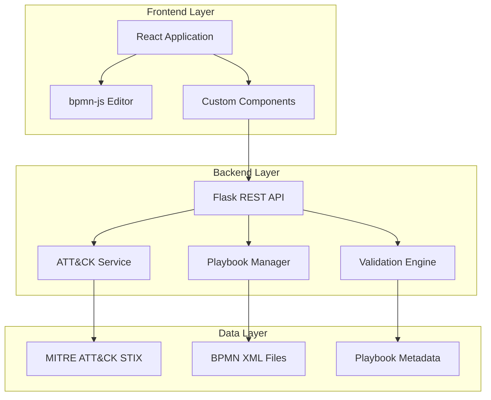
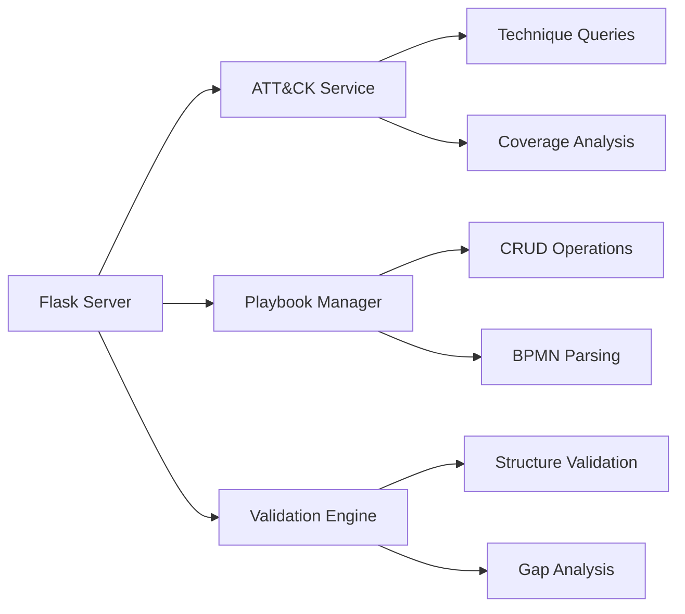
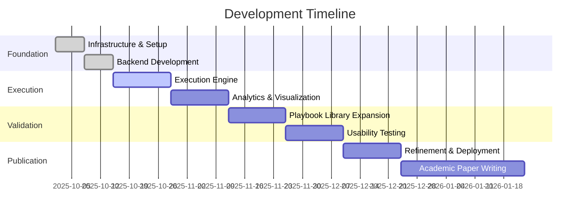

# BPMN Attack Playbooks - Project Documentation

## Executive Summary

This project develops a web-based platform for creating, managing, and executing incident response playbooks using industry-standard BPMN notation integrated with the MITRE ATT&CK framework. The system transforms traditional text-based playbooks into executable, threat-informed workflows that can guide SOC analysts through security incidents.

## Problem Statement

### Current State of IR Playbooks

Security Operations Centers currently manage incident response through one of three approaches:

| Approach | Format | Pros | Cons |
|----------|--------|------|------|
| Traditional | Word/PDF documents | Easy to create | Inconsistent execution, hard to update, not machine-readable |
| Custom Tools | Proprietary metamodels (e.g., FRIPP) | Visual representation | Not standardized, limited tool support, no threat mapping |
| Ad-hoc | Institutional knowledge | Flexible | Not documented, lost when staff leave |

### Critical Gaps

1. **Lack of standardization** - Each organization invents their own format
2. **No threat intelligence integration** - Playbooks don't map to adversary techniques
3. **Limited automation** - Cannot be executed by SOAR platforms
4. **Poor visibility** - No way to measure coverage or identify gaps
5. **Accessibility barriers** - Require specific tools or installations

## Solution Architecture

### Technology Stack



### System Components

#### Frontend (React + bpmn-js)

**Purpose**: Provide visual interface for playbook design and management

**Key Components**:
- `BPMNEditor.jsx` - Visual canvas for designing workflow diagrams
- `ATTACKPanel.jsx` - Browser for MITRE ATT&CK techniques and tactics
- `TaskPropertiesPanel.jsx` - Form for configuring task metadata
- `PlaybookLibrary.jsx` - Interface for managing saved playbooks
- `apiService.js` - Abstraction layer for backend communication

**Technical Details**:
- React 18.2.0 for component architecture
- bpmn-js 17.0.0 for BPMN rendering and editing
- Axios for HTTP requests
- Modern CSS with responsive design

#### Backend (Python Flask)

**Purpose**: Handle data storage, retrieval, validation, and ATT&CK integration

**API Endpoints**:

| Category | Endpoint | Method | Purpose |
|----------|----------|--------|---------|
| Health | `/api/health` | GET | System status check |
| ATT&CK | `/api/attack/techniques` | GET | List all techniques |
| ATT&CK | `/api/attack/techniques/{id}` | GET | Get specific technique |
| ATT&CK | `/api/attack/tactics` | GET | List all tactics |
| ATT&CK | `/api/attack/search` | GET | Search techniques |
| ATT&CK | `/api/attack/coverage` | POST | Calculate coverage |
| ATT&CK | `/api/attack/matrix` | GET | Get ATT&CK matrix |
| Playbooks | `/api/playbooks/` | GET | List playbooks |
| Playbooks | `/api/playbooks/{id}` | GET | Get playbook |
| Playbooks | `/api/playbooks/` | POST | Save playbook |
| Playbooks | `/api/playbooks/{id}` | DELETE | Delete playbook |
| Playbooks | `/api/playbooks/export/{id}` | GET | Export BPMN XML |
| Validation | `/api/validation/validate` | POST | Validate BPMN |
| Validation | `/api/validation/check-coverage` | POST | Check IR coverage |

**Technical Details**:
- Flask 3.0 web framework
- Flask-CORS for cross-origin requests
- lxml for XML parsing
- requests for ATT&CK data download

#### Data Integration

**MITRE ATT&CK Integration**:
- Downloads latest STIX 2.0 data from MITRE GitHub
- Parses and indexes approximately 600+ techniques
- Supports 14 tactics across the Enterprise ATT&CK matrix
- Updates via `scripts/download_attack_data.py`

**Data Sources**:
- `enterprise-attack.json` - Primary ATT&CK dataset
- `mobile-attack.json` - Mobile-specific techniques (optional)
- `ics-attack.json` - Industrial control systems (optional)

### Extended BPMN Metamodel

We extend standard BPMN 2.0 with two custom namespace schemas to support incident response and threat intelligence requirements.

#### Namespace Definitions

```xml
xmlns:bpmn="http://www.omg.org/spec/BPMN/20100524/MODEL"
xmlns:attack="http://attack.mitre.org/bpmn/extension"
xmlns:irp="http://incident-response/bpmn/extension"
```

#### ATT&CK Extension Schema

Maps defensive tasks to adversary techniques and tactics.

```xml
<attack:mapping>
  <attack:technique id="T1486" name="Data Encrypted for Impact"/>
  <attack:tactic>Impact</attack:tactic>
  <attack:subtechnique id="T1486.001" name="Specific Variant"/>
</attack:mapping>
```

#### Incident Response Extension Schema

Captures operational metadata required for task execution.

```xml
<irp:metadata>
  <irp:phase>Containment</irp:phase>
  <irp:role>SOC Analyst L2</irp:role>
  <irp:tool>EDR Console</irp:tool>
  <irp:evidence>Host logs, Network traffic</irp:evidence>
  <irp:priority>high</irp:priority>
  <irp:estimatedTime>30 minutes</irp:estimatedTime>
  <irp:notes>Additional instructions</irp:notes>
</irp:metadata>
```

#### Metadata Field Specifications

| Field | Type | Values | Required |
|-------|------|--------|----------|
| phase | String | preparation, detection, analysis, containment, eradication, recovery, post-incident | Yes |
| role | String | SOC Analyst L1/L2, Incident Responder, Threat Hunter, Forensics Specialist | Yes |
| tool | String | EDR, SIEM, Firewall, Email Gateway, etc. | No |
| evidence | String | Comma-separated list of evidence types | No |
| priority | Enum | low, medium, high, critical | Yes |
| estimatedTime | String | Human-readable duration | No |
| notes | String | Free-text instructions | No |

## Current Implementation Status

### Completed Features (Weeks 1-2)

#### Core Infrastructure

- Project structure with frontend/backend separation
- Version control with Git
- Cross-platform startup scripts (Windows/Linux/Mac)
- Comprehensive documentation suite

#### Backend Capabilities



**Code Statistics**:
- 4 API modules
- 15 REST endpoints
- 3 validation functions
- Approximately 800 lines of Python

#### Frontend Capabilities

**User Interface Flow**:

```mermaid
sequenceDiagram
    participant User
    participant Editor
    participant Properties
    participant ATT&CK
    participant Backend
    
    User->>Editor: Create/Open Playbook
    Editor->>Backend: Load BPMN XML
    User->>Editor: Add Task
    User->>Properties: Configure Task
    User->>ATT&CK: Select Technique
    ATT&CK->>Backend: Search Techniques
    Backend-->>ATT&CK: Return Results
    Properties->>Editor: Update Task
    User->>Editor: Save Playbook
    Editor->>Backend: POST /api/playbooks/
```

**Code Statistics**:
- 5 React components
- 1 API service module
- Approximately 1,200 lines of JavaScript/JSX
- Professional CSS styling

#### Example Playbooks

**Ransomware Response Playbook**:
- 8 sequential tasks covering full incident lifecycle
- Maps to 5 ATT&CK techniques (T1486, T1490, T1489, T1491, T1071)
- Phases: Detection, Analysis, Containment, Eradication, Recovery
- Estimated total time: 4-6 hours

**Phishing Investigation Playbook**:
- 7 tasks for email-based attack response
- Maps to 4 ATT&CK techniques (T1566.001, T1566.002, T1204.002, T1071)
- Phases: Detection, Analysis, Containment
- Estimated total time: 2-3 hours

### Testing and Validation

All core functionalities have been verified:

- Backend starts without errors and serves API
- Frontend connects successfully to backend
- ATT&CK data downloads and parses correctly
- Example playbooks load and render properly
- BPMN editor supports full create/edit workflow
- ATT&CK panel displays all tactics and techniques
- Validation engine detects structural issues
- Save/export functions produce valid BPMN XML

## Innovation and Research Contribution

### Comparison to Baseline Work

The baseline work (FRIPP by Shaked et al., 2022) introduced model-based IR playbooks using a custom metamodel in an Eclipse plugin.

| Aspect | FRIPP (Baseline) | This Implementation |
|--------|------------------|---------------------|
| Modeling Language | Custom metamodel | BPMN 2.0 (ISO 19510) |
| Threat Intelligence | Not integrated | Full MITRE ATT&CK integration |
| Platform | Eclipse plugin | Web-based application |
| Execution Capability | Design only | Executable workflows |
| Export Format | Proprietary | Standard BPMN XML |
| Validation | Visual gap indicators | Structural + semantic + coverage |
| SOAR Integration | Not supported | Standard BPMN compatible |
| Accessibility | Requires Eclipse installation | Browser-based, no installation |
| Adversary Mapping | None | Technique-level ATT&CK mapping |
| Coverage Analysis | Not available | ATT&CK matrix coverage |

### Key Innovations

1. **Industry Standard Adoption**: First IR playbook system using BPMN 2.0 instead of proprietary formats, enabling interoperability with existing business process and SOAR tools.

2. **Threat-Informed Defense**: Direct integration of MITRE ATT&CK at the task level creates bidirectional mapping between defensive actions and offensive techniques.

3. **Operationalization**: Playbooks are not just visual models but executable workflows that can guide analysts through incidents and integrate with automation platforms.

4. **Coverage Visibility**: Automatic analysis of which ATT&CK techniques are addressed by playbooks, identifying defensive gaps.

5. **Web Accessibility**: Browser-based interface eliminates installation barriers and enables collaborative playbook development.

### Research Questions Addressed

**RQ1: Can incident response playbooks be effectively operationalized using industry standards?**

The implementation demonstrates that BPMN 2.0 provides sufficient expressiveness for IR workflows while maintaining compatibility with existing process automation infrastructure. Both example playbooks successfully model complex incident scenarios with proper sequencing, decision points, and task metadata.

**RQ2: How can playbooks be mapped to adversary behavior?**

By extending BPMN with ATT&CK technique identifiers at the task level, we create explicit links between defensive actions and the specific attacks they counter. This enables automated coverage analysis and gap identification.

**RQ3: What value does ATT&CK integration provide?**

The integration enables five key capabilities:
- Coverage visibility (which techniques can we respond to)
- Gap identification (which techniques have no response)
- Threat-informed playbook development
- Quantitative maturity metrics
- Prioritization based on threat landscape

## Development Roadmap

### Weeks 3-4: Execution Engine

**Objective**: Transform playbooks from design artifacts to operational guides

**Planned Features**:
- Playbook execution engine with state management
- SOC dashboard showing active incidents and task status
- Timeline tracking for incident chronology
- Evidence attachment system (files, screenshots, logs)
- Task status workflow (pending, in progress, completed, blocked)
- Incident report generation from execution data

**Technical Approach**:
- Implement execution state machine
- Add database for incident tracking
- Create real-time updates via WebSocket
- Build evidence storage system

### Weeks 5-6: Analytics and Visualization

**Objective**: Provide insights into IR capabilities and performance

**Planned Features**:
- ATT&CK coverage heatmap showing technique coverage
- Playbook analytics dashboard with usage metrics
- Performance analysis (average time per task, bottlenecks)
- Gap analysis reports with recommendations
- Trend tracking over time
- Export capabilities for reports

**Technical Approach**:
- Implement data aggregation queries
- Create visualization components (heatmaps, charts)
- Build report generation engine
- Add export to PDF/CSV

### Weeks 7-8: Playbook Library Expansion

**Objective**: Build comprehensive coverage of common incident types

**Target Playbooks**:
- DDoS Attack Response
- Data Breach Investigation
- Insider Threat Detection
- Malware Outbreak Response
- Credential Compromise
- SQL Injection Response
- Business Email Compromise
- Zero-Day Vulnerability Response
- Supply Chain Attack
- Cloud Account Takeover

**Approach**:
- Research industry best practices for each scenario
- Map to relevant ATT&CK techniques
- Validate with security practitioners
- Document each playbook thoroughly

### Weeks 9-10: Usability Testing

**Objective**: Validate tool effectiveness with target users

**Methodology**:
- Recruit 5-10 SOC analysts with varying experience levels
- Create realistic incident scenarios
- Observe playbook creation and execution
- Conduct structured interviews
- Administer usability surveys

**Metrics to Collect**:
- Time to create a playbook
- Accuracy of ATT&CK mappings
- Task completion time with vs. without playbooks
- User satisfaction scores
- Feature requests and pain points

### Weeks 11-12: Refinement and Deployment

**Objective**: Production-ready system

**Activities**:
- Implement high-priority feature requests from testing
- Address usability issues
- Performance optimization
- Security hardening
- Production deployment preparation
- User documentation and training materials
- Video tutorials

### Week 13+: Academic Publication

**Objective**: Disseminate research findings

**Target Venues**:
- ARES Conference (continuation of baseline work)
- ACM CCS Workshop on Cyber Security Operations
- IEEE Security & Privacy
- USENIX Security (poster/demo track)

**Paper Structure**:
1. Introduction - IR challenges and formalization needs
2. Related Work - FRIPP, CACAO, RE&CT, SOAR platforms
3. Approach - BPMN + ATT&CK integration design
4. Implementation - System architecture and features
5. Evaluation - Usability study results and deployment findings
6. Discussion - Benefits, limitations, lessons learned
7. Conclusion - Research contributions and future work

## Technical Details

### Installation and Setup

#### Prerequisites

- Python 3.8 or higher
- Node.js 16 or higher
- Modern web browser (Chrome, Firefox, Edge)

#### Backend Setup

```bash
cd backend
python -m venv venv
source venv/bin/activate  # Linux/Mac
venv\Scripts\activate     # Windows
pip install -r requirements.txt
python scripts/download_attack_data.py
python main.py
```

Backend serves on `http://localhost:5000`

#### Frontend Setup

```bash
cd frontend
npm install
npm start
```

Frontend serves on `http://localhost:3000`

### Configuration

**Backend** (`backend/main.py`):
- Port: 5000 (configurable)
- Debug mode: Enabled for development
- CORS: Configured for localhost:3000

**Frontend** (`frontend/package.json`):
- Proxy: Configured to backend at localhost:5000
- Development server: Uses CRACO for webpack configuration
- Build output: Static files in `frontend/build/`

### File Structure

```
bpmn-attack-playbooks/
├── backend/
│   ├── api/
│   │   ├── __init__.py
│   │   ├── attack.py          # ATT&CK endpoints
│   │   ├── playbooks.py       # Playbook CRUD
│   │   └── validation.py      # Validation logic
│   ├── data/
│   │   └── attack_data/
│   │       └── enterprise-attack.json
│   ├── scripts/
│   │   └── download_attack_data.py
│   ├── requirements.txt
│   └── main.py
├── frontend/
│   ├── public/
│   │   └── index.html
│   ├── src/
│   │   ├── components/
│   │   │   ├── ATTACKPanel.jsx
│   │   │   ├── BPMNEditor.jsx
│   │   │   ├── PlaybookLibrary.jsx
│   │   │   └── TaskPropertiesPanel.jsx
│   │   ├── services/
│   │   │   └── apiService.js
│   │   ├── App.js
│   │   └── index.js
│   ├── craco.config.js
│   └── package.json
├── playbook-examples/
│   ├── ransomware-response.bpmn
│   └── phishing-investigation.bpmn
├── docs/
│   ├── metamodel.md
│   ├── research-context.md
│   └── user-guide.md
└── README.md
```

## Current Status

### Completion Metrics

- Core infrastructure: 100%
- Backend API: 100%
- Frontend UI: 100%
- ATT&CK integration: 100%
- Example playbooks: 100%
- Documentation: 100%
- Execution engine: 0% (planned for weeks 3-4)
- Analytics: 0% (planned for weeks 5-6)

### System Health

All systems operational and tested:
- Backend API serving correctly
- Frontend connecting without errors
- BPMN editor fully functional
- ATT&CK data integration working
- Validation system operational
- Example playbooks loading successfully

### Recent Fixes

**Webpack Dev Server Configuration** (resolved):
- Issue: `allowedHosts` validation error preventing frontend startup
- Solution: Implemented CRACO configuration override
- Status: Frontend now starts successfully without errors
- Files modified: `package.json`, `craco.config.js`, `.env`

## References

1. Shaked, A., Cherdantseva, Y., & Burnap, P. (2022). Model-based incident response playbooks. ARES 2022.
2. MITRE ATT&CK Framework. https://attack.mitre.org/
3. OASIS CACAO Playbooks. https://www.oasis-open.org/committees/cacao/
4. NIST SP 800-61 Rev. 2: Computer Security Incident Handling Guide
5. OMG BPMN 2.0 Specification. https://www.omg.org/spec/BPMN/2.0/

## Project Timeline



Last updated: October 15, 2025
