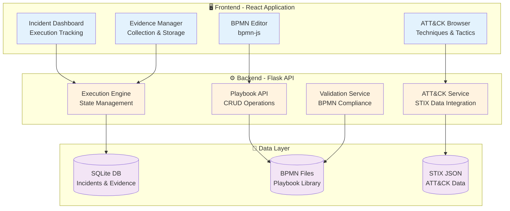

# BPMN-ATT&CK Incident Response Playbooks

> **Operationalizing Threat-Informed Incident Response through Executable BPMN Workflows**

[](https://doi.org/10.1145/3538969.3538976)
[](LICENSE)

---

## Overview

This platform enables security teams to design, manage, and execute incident response playbooks using industry-standard **BPMN 2.0** notation integrated with the **MITRE ATT&CK** framework. By combining visual process modeling with threat intelligence, organizations can create executable, threat-informed workflows that guide analysts through complex security incidents.

### Core Innovation

Traditional incident response playbooks are static documents (PDFs, Word files) that lack standardization and cannot be automated. This project transforms playbooks into **executable workflows** that:

- Use **BPMN 2.0** (industry standard) instead of proprietary formats
- Map every task to **MITRE ATT&CK techniques** for threat context
- Provide **real-time execution tracking** with evidence collection
- Calculate **ATT&CK coverage** and identify defensive gaps
- Export **SOAR-compatible** workflows for automation platforms

## Architecture



## Key Features

### Visual Playbook Designer
- Drag-and-drop BPMN editor with industry-standard notation
- Task configuration (role, tool, priority, estimated time)
- Real-time validation and compliance checking
- Export to BPMN XML for portability

### MITRE ATT&CK Integration
- Browse 600+ techniques across 14 tactics
- Map multiple techniques per task
- Automatic coverage matrix generation
- Gap analysis for defensive planning

### Incident Execution
- Create incidents from playbook templates
- Track task completion in real-time
- Collect and organize evidence
- Generate timeline of analyst actions
- Progress tracking with metrics

### Analytics & Insights
- ATT&CK coverage visualization
- Task duration analysis
- Incident statistics dashboard
- Evidence repository

## Quick Start

### Prerequisites
- **Python 3.8+** (Python 3.11-3.12 recommended)
- **Node.js 16+** and npm
- Git

### Installation

```bash
# Clone the repository
git clone https://github.com/yourusername/bpmn-attack-playbooks.git
cd bpmn-attack-playbooks

# Backend setup
cd backend
python -m venv venv
venv\Scripts\activate          # Windows
# source venv/bin/activate     # Linux/Mac
pip install -r requirements.txt
python scripts/download_attack_data.py
python main.py

# Frontend setup (new terminal)
cd frontend
npm install
npm start
```

**Access the application**: http://localhost:3000

## Installation & Setup

For detailed installation instructions, see the Quick Start section above. Additional setup details:

**Prerequisites**: Python 3.8+ (3.11-3.12 recommended), Node.js 16+, npm 8+

**Troubleshooting**:
- If port 5000 or 3000 is in use, kill the process or change the port
- For Python 3.13: Execution engine may be disabled due to SQLAlchemy compatibility
- Backend health check: `http://localhost:5000/api/health`

For comprehensive documentation, see the [`docs/`](./docs) directory.

## Research Context

### Baseline Paper
This work extends the research presented in:

> **Shaked, A., Cherdantseva, Y., & Burnap, P. (2022).**  
> *"Model-Based Incident Response Playbooks."*  
> In Proceedings of the 17th International Conference on Availability, Reliability and Security (ARES 2022), August 23-26, 2022, Vienna, Austria.  
> DOI: [10.1145/3538969.3538976](https://doi.org/10.1145/3538969.3538976) | [PDF](https://orca.cardiff.ac.uk/id/eprint/166210/1/ARES%20-%20Conference%20Paper%20-%20Model-based%20Playbooks.pdf)

### Extensions & Contributions

| Aspect | Baseline (FRIPP) | Our Implementation |
|--------|------------------|-------------------|
| **Notation** | Custom metamodel | BPMN 2.0 (ISO 19510) |
| **Threat Intelligence** | None | MITRE ATT&CK integration |
| **Execution** | Design-only | Full execution engine |
| **Platform** | Requires installation | Web-based (browser) |
| **Automation** | Limited | SOAR-compatible exports |
| **Coverage Analysis** | Manual | Automated ATT&CK matrix |

### Authors
**Mohamed Trigui** - Illinois Institute of Technology, Co-Terminal (Bachelor's and Master's) Student  
**Zuha Ansari** - Illinois Institute of Technology, Bachelor's Student

## Documentation

Comprehensive documentation is available in the [`docs/`](./docs) directory:

- [**User Guide**](./docs/user-guide.md) - Complete walkthrough for analysts
- [**Backend Architecture**](./docs/backend-architecture.md) - API design and database schema
- [**Frontend Architecture**](./docs/frontend-architecture.md) - Component structure and state management
- [**ATT&CK Integration**](./docs/attack-integration.md) - STIX data handling and mapping logic
- [**Research Context**](./docs/research-context.md) - Academic background and related work

## Demo Video

**[Watch the Platform Demo](./progress-video)**

The demo showcases:
1. Creating a phishing incident response playbook
2. Mapping tasks to ATT&CK techniques
3. Executing an incident with evidence collection
4. Generating coverage analysis

## Project Structure

```
bpmn-attack-playbooks/
├── backend/                 # Flask REST API
│   ├── api/                # Endpoint modules
│   ├── models/             # Database models
│   ├── scripts/            # Utility scripts
│   └── data/               # ATT&CK data & SQLite DB
├── frontend/               # React application
│   └── src/
│       ├── components/     # React components
│       └── services/       # API client
├── playbook-examples/      # Sample BPMN playbooks
├── docs/                   # Documentation
└── progress-video/         # Demo recording
```

## Technology Stack

**Frontend**
- React 18.2.0
- bpmn-js 17.0.0 (BPMN rendering)
- Axios (HTTP client)

**Backend**
- Flask 3.1.0
- SQLAlchemy 2.0 (ORM)
- Flask-CORS (API access)

**Data**
- SQLite (incidents & evidence)
- BPMN 2.0 XML (playbooks)
- MITRE ATT&CK STIX 2.1 (threat intelligence)

## Use Cases

### 1. Security Operations Center (SOC)
- Standardize incident response procedures
- Guide L1/L2 analysts through complex investigations
- Track analyst actions and evidence

### 2. Incident Response Teams
- Document post-incident processes
- Ensure consistent handling of breaches
- Generate metrics for improvement

### 3. Red/Purple Teams
- Map defensive playbooks to attack techniques
- Identify coverage gaps
- Design tabletop exercises

### 4. Compliance & Audit
- Demonstrate documented IR procedures
- Track playbook usage and effectiveness
- Export reports for auditors

## Roadmap

See [ROADMAP.md](./docs/ROADMAP.md) for current status, known issues, and planned enhancements.

## Contributing

We welcome contributions! Areas for improvement:
- Additional playbook examples (malware, DDoS, data breach)
- Integration with SOAR platforms (Splunk SOAR, Cortex XSOAR)
- Mobile-responsive design
- Multi-user collaboration features

## License

MIT License - See [LICENSE](LICENSE) for details

## Acknowledgments

- **MITRE Corporation** for the ATT&CK framework and STIX data
- **bpmn.io** for the excellent bpmn-js library
- **Illinois Institute of Technology** for academic support

---

**Contact:**  
Mohamed Trigui - mtrigui@hawk.iit.edu  
Zuha Ansari - zansari1@hawk.iit.edu
