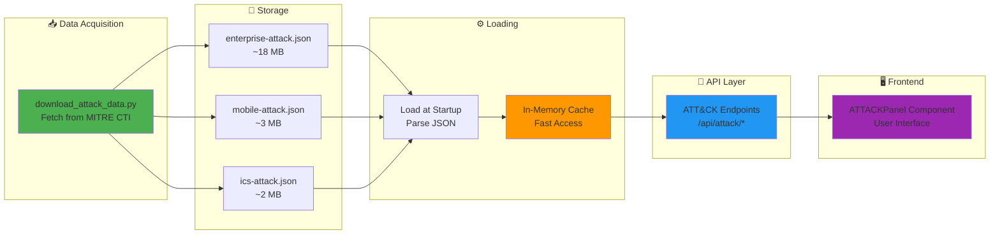

# MITRE ATT&CK Integration

## Overview

This document explains how the platform integrates MITRE ATT&CK framework data using STIX 2.1 format, enabling threat-informed playbook design and coverage analysis.

## Data Source

### MITRE ATT&CK STIX Data
The system uses official STIX 2.1 JSON files from MITRE's CTI repository:

- **Enterprise ATT&CK**: ~600 techniques across 14 tactics
- **Mobile ATT&CK**: Mobile-specific techniques
- **ICS ATT&CK**: Industrial Control Systems techniques

**Source**: [github.com/mitre/cti](https://github.com/mitre/cti)

### Data Format
STIX (Structured Threat Information Expression) 2.1 JSON format provides standardized representation of cyber threat intelligence.

```json
{
  "type": "attack-pattern",
  "id": "attack-pattern--T1566.001",
  "name": "Phishing: Spearphishing Attachment",
  "description": "Adversaries may send spearphishing emails with malicious attachments...",
  "x_mitre_platforms": ["Windows", "macOS", "Linux"],
  "kill_chain_phases": [{
    "kill_chain_name": "mitre-attack",
    "phase_name": "initial-access"
  }]
}
```

## Architecture



## Data Download

### Script: `download_attack_data.py`

Automatically fetches the latest ATT&CK data from MITRE's GitHub repository.

**Usage:**
```bash
cd backend
python scripts/download_attack_data.py
```

**What it does:**
1. Creates `data/attack_data/` directory
2. Downloads three STIX bundles:
   - enterprise-attack.json
   - mobile-attack.json  
   - ics-attack.json
3. Validates JSON structure
4. Reports statistics (tactics count, techniques count)

**URLs:**
```python
ATTACK_URLS = {
    'enterprise': 'https://raw.githubusercontent.com/mitre/cti/master/enterprise-attack/enterprise-attack.json',
    'mobile': 'https://raw.githubusercontent.com/mitre/cti/master/mobile-attack/mobile-attack.json',
    'ics': 'https://raw.githubusercontent.com/mitre/cti/master/ics-attack/ics-attack.json'
}
```

## Backend Processing

### Loading ATT&CK Data

**File**: `backend/api/attack.py`

```python
def load_attack_data():
    """Load MITRE ATT&CK STIX data from JSON files"""
    data_dir = Path(__file__).parent.parent / 'data' / 'attack_data'
    
    # Load enterprise ATT&CK
    with open(data_dir / 'enterprise-attack.json', 'r') as f:
        enterprise = json.load(f)
    
    # Extract techniques and tactics from STIX bundle
    techniques = [obj for obj in enterprise['objects'] 
                  if obj['type'] == 'attack-pattern']
    
    tactics = [obj for obj in enterprise['objects']
               if obj['type'] == 'x-mitre-tactic']
    
    return {'techniques': techniques, 'tactics': tactics}
```

### In-Memory Caching

Data is loaded once at application startup and cached:

```python
# Global cache
ATTACK_DATA = load_attack_data()
```

**Benefits:**
- ✅ Fast lookups (no disk I/O)
- ✅ Consistent data throughout session
- ✅ No database overhead

**Tradeoffs:**
- ❌ Memory usage: ~50 MB
- ❌ Manual refresh needed for updates

### Data Transformation

STIX objects are transformed into simplified format for frontend:

**STIX Input:**
```json
{
  "type": "attack-pattern",
  "id": "attack-pattern--d1fcf083-a721-4223-aedf-bf8960798d62",
  "external_references": [{
    "external_id": "T1566.001",
    "source_name": "mitre-attack"
  }],
  "name": "Phishing: Spearphishing Attachment",
  "kill_chain_phases": [{
    "phase_name": "initial-access"
  }],
  "x_mitre_platforms": ["Windows", "macOS"]
}
```

**Transformed Output:**
```json
{
  "id": "T1566.001",
  "name": "Phishing: Spearphishing Attachment",
  "description": "Adversaries may send spearphishing emails...",
  "tactics": ["Initial Access"],
  "platforms": ["Windows", "macOS"],
  "data_sources": ["Email: Email Content"],
  "url": "https://attack.mitre.org/techniques/T1566/001"
}
```

## API Endpoints

### GET /api/attack/tactics

Returns all 14 tactics in the ATT&CK framework.

**Response:**
```json
{
  "count": 14,
  "tactics": [
    {
      "id": "TA0001",
      "name": "Initial Access",
      "short_name": "initial-access",
      "description": "The adversary is trying to get into your network.",
      "url": "https://attack.mitre.org/tactics/TA0001"
    }
  ]
}
```

---

### GET /api/attack/techniques

List techniques with optional filtering.

**Query Parameters:**
- `tactic` - Filter by tactic (e.g., "initial-access")
- `platform` - Filter by platform (e.g., "Windows")
- `parent_only` - Boolean, exclude sub-techniques

**Example:**
```
GET /api/attack/techniques?tactic=initial-access&parent_only=true
```

**Response:**
```json
{
  "count": 9,
  "techniques": [
    {
      "id": "T1566",
      "name": "Phishing",
      "tactics": ["Initial Access"],
      "platforms": ["Windows", "macOS", "Linux"],
      "has_subtechniques": true
    }
  ]
}
```

---

### GET /api/attack/techniques/{id}

Get detailed information about specific technique.

**Example:**
```
GET /api/attack/techniques/T1566.001
```

**Response:**
```json
{
  "id": "T1566.001",
  "name": "Phishing: Spearphishing Attachment",
  "description": "Full description...",
  "tactics": ["Initial Access"],
  "platforms": ["Windows", "macOS", "Linux"],
  "data_sources": ["Email: Email Content", "File: File Creation"],
  "detection": "Detection methods...",
  "parent": "T1566",
  "url": "https://attack.mitre.org/techniques/T1566/001"
}
```

---

### GET /api/attack/search

Search techniques by keyword.

**Query Parameters:**
- `q` - Search query

**Example:**
```
GET /api/attack/search?q=credential
```

Returns techniques with "credential" in name or description.

---

### POST /api/attack/coverage

Calculate ATT&CK coverage based on playbook techniques.

**Request:**
```json
{
  "techniques": ["T1566", "T1059", "T1003"]
}
```

**Response:**
```json
{
  "total_techniques": 600,
  "covered_techniques": 3,
  "coverage_percentage": 0.5,
  "tactics_covered": {
    "Initial Access": 1,
    "Execution": 1,
    "Credential Access": 1
  },
  "gaps": {
    "Persistence": 0,
    "Privilege Escalation": 0,
    "Defense Evasion": 0
  }
}
```

---

### GET /api/attack/matrix

Returns full ATT&CK matrix structure for visualization.

**Response:**
```json
{
  "tactics": [
    {
      "id": "TA0001",
      "name": "Initial Access",
      "techniques": ["T1566", "T1190", "T1133"]
    }
  ]
}
```

## Frontend Integration

### ATTACKPanel Component

**Browse by Tactic:**
```javascript
// Load all tactics
const tactics = await attackAPI.getTactics();

// User clicks tactic
const techniques = await attackAPI.getTechniques({ 
  tactic: 'initial-access',
  parent_only: true 
});
```

**Search:**
```javascript
// User types search query
const results = await attackAPI.searchTechniques('phishing');
```

**Selection:**
```javascript
// User clicks technique to select
const toggleTechniqueSelection = (technique) => {
  setSelectedTechniques(prev => {
    const exists = prev.find(t => t.id === technique.id);
    if (exists) {
      return prev.filter(t => t.id !== technique.id);
    } else {
      return [...prev, technique];
    }
  });
};
```

### Mapping to BPMN Tasks

When user clicks "Apply Changes" in TaskPropertiesPanel:

```javascript
const techniqueIds = selectedTechniques.map(t => t.id).join(',');
const tacticNames = [...new Set(
  selectedTechniques.flatMap(t => t.tactics)
)].join(',');

modeling.updateProperties(element, {
  'attack:techniques': techniqueIds,     // "T1566.001,T1566.002"
  'attack:tactics': tacticNames          // "Initial Access"
});
```

**Resulting BPMN XML:**
```xml
<bpmn:task 
  id="Task_1" 
  name="Analyze Email"
  attack:techniques="T1566.001,T1566.002"
  attack:tactics="Initial Access" />
```

## Storage in Playbooks

### BPMN Extension Namespace

Defined in BPMN root element:
```xml
<bpmn:definitions 
  xmlns:bpmn="http://www.omg.org/spec/BPMN/20100524/MODEL"
  xmlns:attack="http://attack.mitre.org/bpmn/extension"
  ...>
```

### Two Storage Methods

#### Method 1: Attributes (Recommended)
```xml
<bpmn:task 
  attack:techniques="T1566.001,T1566.002" 
  attack:tactics="Initial Access" />
```

#### Method 2: Extension Elements
```xml
<bpmn:task>
  <bpmn:extensionElements>
    <attack:mapping>
      <attack:technique id="T1566.001" name="Phishing: Spearphishing Attachment"/>
      <attack:tactic>Initial Access</attack:tactic>
    </attack:mapping>
  </bpmn:extensionElements>
</bpmn:task>
```

Both formats are parsed and understood by the backend.

## Coverage Analysis

### Playbook Coverage Calculation

When creating an incident, the backend extracts all ATT&CK techniques from the playbook:

```python
def parse_bpmn_tasks(bpmn_xml):
    root = ET.fromstring(bpmn_xml)
    
    all_techniques = []
    all_tactics = []
    
    for task in root.findall('.//{http://www.omg.org/spec/BPMN/20100524/MODEL}task'):
        # Extract from attributes
        tech_attr = task.get('{http://attack.mitre.org/bpmn/extension}techniques', '')
        if tech_attr:
            all_techniques.extend(tech_attr.split(','))
        
        tactic_attr = task.get('{http://attack.mitre.org/bpmn/extension}tactics', '')
        if tactic_attr:
            all_tactics.extend(tactic_attr.split(','))
    
    return {
        'techniques': list(set(all_techniques)),
        'tactics': list(set(all_tactics))
    }
```

### Coverage Matrix

Generates heatmap showing coverage by tactic:

```
Tactic              | Techniques Covered | Total | %
--------------------|-------------------|-------|-----
Initial Access      | 3                 | 9     | 33%
Execution           | 5                 | 13    | 38%
Persistence         | 0                 | 19    | 0%
Privilege Escalation| 1                 | 13    | 8%
...
```

## Real-World Usage Example

### Scenario: Phishing Response Playbook

1. **Analyst designs playbook** with 6 tasks
2. **Task 1: Analyze Email**
   - Maps to T1566.001 (Spearphishing Attachment)
   - Maps to T1566.002 (Spearphishing Link)
   - Tactic: Initial Access

3. **Task 2: Check for Execution**
   - Maps to T1059.001 (PowerShell)
   - Maps to T1059.003 (Windows Command Shell)
   - Tactic: Execution

4. **Task 3: Hunt for Persistence**
   - Maps to T1547.001 (Registry Run Keys)
   - Tactic: Persistence

5. **Coverage Result:**
   - 5 techniques mapped
   - 3 tactics covered
   - Coverage: 0.8% of Enterprise ATT&CK (5/600)
   - Gap: No coverage for Defense Evasion, Credential Access, Discovery, etc.

6. **Actionable Insight:** Playbook focuses on early-stage detection. Consider adding tasks for lateral movement and data exfiltration phases.

## Future Enhancements

- [ ] **D3ATT&CK Integration**: Map defensive capabilities to techniques
- [ ] **Threat Group Profiles**: Filter techniques by APT group
- [ ] **Navigator Export**: Generate ATT&CK Navigator layers
- [ ] **Detection Rules**: Link to Sigma/YARA rules for each technique
- [ ] **Mitigation Guidance**: Display M-codes (Mitigations) for each technique
- [ ] **ATT&CK Versions**: Support multiple ATT&CK versions
- [ ] **Auto-Update**: Periodic refresh from MITRE CTI repo
- [ ] **Custom Techniques**: Allow user-defined techniques

