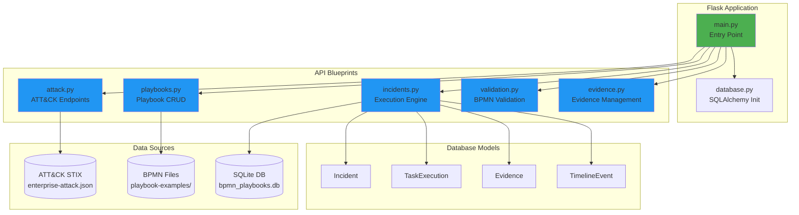
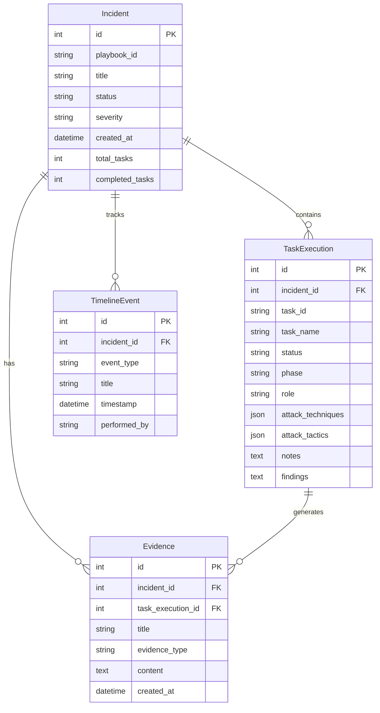

# Backend Architecture

## Overview

The backend is a RESTful API built with Flask that provides playbook management, MITRE ATT&CK data access, incident execution tracking, and BPMN validation services.

## Technology Stack

- **Framework**: Flask 3.1.0
- **Database**: SQLAlchemy 2.0 + SQLite
- **CORS**: Flask-CORS 5.0.0
- **Data Format**: STIX 2.1 JSON (ATT&CK), BPMN 2.0 XML (Playbooks)

## Architecture Diagram



## API Endpoints

### Health Check
```
GET /api/health
```
Returns system status and available features.

**Response:**
```json
{
  "status": "healthy",
  "database_available": true,
  "execution_engine": "enabled",
  "endpoints": {
    "attack": "/api/attack",
    "playbooks": "/api/playbooks",
    "incidents": "/api/incidents",
    "validation": "/api/validation"
  }
}
```

### ATT&CK API

#### List Techniques
```
GET /api/attack/techniques?tactic={tactic}&parent_only={bool}
```

#### Get Technique Details
```
GET /api/attack/techniques/{technique_id}
```

#### List Tactics
```
GET /api/attack/tactics
```

#### Search Techniques
```
GET /api/attack/search?q={query}
```

#### Calculate Coverage
```
POST /api/attack/coverage
Body: { "techniques": ["T1566", "T1059"] }
```

### Playbook API

#### List Playbooks
```
GET /api/playbooks/
```
Returns all playbooks with metadata (task count, ATT&CK techniques).

#### Get Playbook
```
GET /api/playbooks/{playbook_id}
```
Returns full BPMN XML and metadata.

#### Save Playbook
```
POST /api/playbooks/
Body: {
  "id": "my-playbook",
  "bpmn_xml": "<?xml version='1.0'?><bpmn:definitions>...</bpmn:definitions>"
}
```

#### Delete Playbook
```
DELETE /api/playbooks/{playbook_id}
```

### Incident Execution API

#### List Incidents
```
GET /api/incidents/?status={status}&severity={severity}
```

#### Get Incident
```
GET /api/incidents/{incident_id}
```

#### Create Incident
```
POST /api/incidents/
Body: {
  "playbook_id": "phishing-investigation",
  "title": "Suspicious Email - CEO",
  "severity": "high",
  "assigned_to": "John Doe"
}
```

#### Update Task
```
PUT /api/incidents/{incident_id}/tasks/{task_id}
Body: {
  "status": "completed",
  "notes": "Email verified as malicious",
  "findings": "Credential harvesting attempt",
  "actions_taken": "Blocked sender, reset user password"
}
```

#### Add Evidence
```
POST /api/incidents/{incident_id}/evidence
Body: {
  "title": "Email Headers",
  "evidence_type": "log",
  "content": "...",
  "task_execution_id": 123
}
```

## Database Schema



## Database Models

### Incident
Represents an active or completed incident response case.

**Fields:**
- `playbook_id`: ID of the BPMN playbook used
- `status`: active, completed, cancelled, on-hold
- `severity`: low, medium, high, critical
- `assigned_to`: Primary analyst
- `progress_percentage`: Calculated from completed tasks

### TaskExecution
Tracks individual task completion within an incident.

**Fields:**
- `task_id`: Original BPMN element ID
- `status`: pending, in_progress, completed, blocked, failed
- `phase`: detection, analysis, containment, eradication, recovery
- `attack_techniques`: JSON array of ATT&CK technique IDs
- `notes`, `findings`, `actions_taken`: Analyst documentation

### Evidence
Stores artifacts collected during incident response.

**Types:** file, screenshot, url, note, log, ioc

### TimelineEvent
Logs all actions taken during incident for audit trail.

## BPMN Parsing

The system parses BPMN XML to extract:

### Extension Elements
Tasks can have custom metadata in `extensionElements`:

```xml
<bpmn:task id="Task_1" name="Analyze Email">
  <bpmn:extensionElements>
    <irp:phase>analysis</irp:phase>
    <irp:role>SOC Analyst L1</irp:role>
    <irp:priority>high</irp:priority>
    <attack:techniques>T1566.001,T1566.002</attack:techniques>
    <attack:tactics>Initial Access</attack:tactics>
  </bpmn:extensionElements>
</bpmn:task>
```

### Custom Attributes
Alternatively, attributes can be set directly:

```xml
<bpmn:task 
  id="Task_1" 
  name="Analyze Email"
  irp:phase="analysis"
  irp:role="SOC Analyst L1"
  attack:techniques="T1566.001,T1566.002" />
```

Both formats are supported for maximum compatibility.

## File Structure

```
backend/
├── main.py                 # Flask app initialization
├── database.py             # SQLAlchemy setup
├── check_python.py         # Python version compatibility
├── reset_database.py       # Development utility
├── requirements.txt        # Python dependencies
├── api/
│   ├── __init__.py
│   ├── attack.py          # ATT&CK API
│   ├── playbooks.py       # Playbook CRUD
│   ├── incidents.py       # Execution engine
│   ├── validation.py      # BPMN validation
│   └── evidence.py        # Evidence management
├── models/
│   ├── __init__.py
│   ├── incident.py
│   ├── task_execution.py
│   ├── evidence.py
│   └── timeline_event.py
├── scripts/
│   └── download_attack_data.py
└── data/
    ├── attack_data/       # MITRE ATT&CK STIX files
    ├── evidence/          # Uploaded evidence files
    └── bpmn_playbooks.db  # SQLite database
```

## Python Version Compatibility

The system includes Python 3.13 compatibility checks due to SQLAlchemy issues:

- **Recommended**: Python 3.11 or 3.12
- **Python 3.13**: Execution engine gracefully degrades if SQLAlchemy fails
- **Minimum**: Python 3.8

When running on Python 3.13, the playbook editor and ATT&CK browser work normally, but incident tracking may be disabled.

## Error Handling

All endpoints use consistent error response format:

```json
{
  "error": "Description of what went wrong",
  "details": "Technical error message (dev mode only)"
}
```

HTTP status codes:
- `200` - Success
- `400` - Bad request (validation error)
- `404` - Resource not found
- `500` - Server error

## Performance Considerations

### Caching
- ATT&CK data is loaded once at startup and cached in memory
- Playbook metadata is extracted on-demand

### Database
- SQLite is suitable for <1000 incidents
- For production, migrate to PostgreSQL

### File Storage
- Evidence files stored in `data/evidence/`
- For production, use S3 or similar object storage

## Deployment

### Development
```bash
python main.py  # Runs on localhost:5000
```

### Production (Example with Gunicorn)
```bash
pip install gunicorn
gunicorn -w 4 -b 0.0.0.0:5000 main:app
```

### Environment Variables
```bash
DATABASE_URL=sqlite:///data/bpmn_playbooks.db
FLASK_ENV=production
SECRET_KEY=your-secret-key-here
```

## Testing

Verify backend functionality:

```bash
# Health check
curl http://localhost:5000/api/health

# List playbooks
curl http://localhost:5000/api/playbooks/

# Get ATT&CK tactics
curl http://localhost:5000/api/attack/tactics
```

## Future Enhancements

- [ ] PostgreSQL support for production deployments
- [ ] JWT authentication for multi-user access
- [ ] WebSocket support for real-time incident updates
- [ ] Elasticsearch integration for evidence search
- [ ] Rate limiting for API protection
- [ ] Prometheus metrics endpoint

