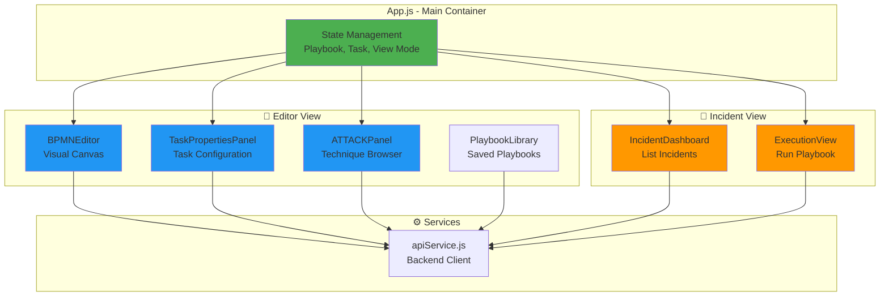
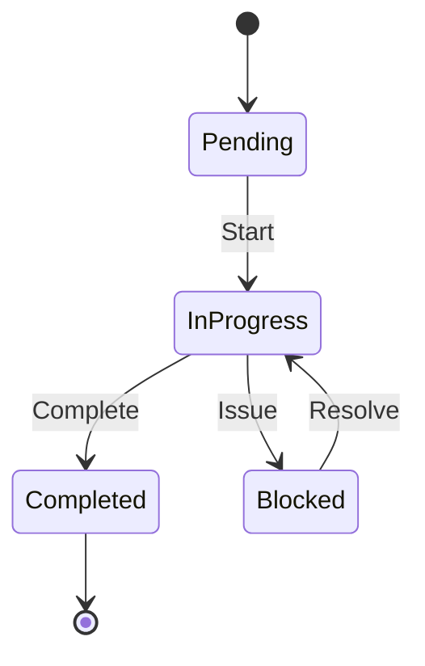

# Frontend Architecture

## Overview

The frontend is a single-page React application that provides a visual interface for designing BPMN playbooks, browsing MITRE ATT&CK techniques, and managing incident execution.

## Technology Stack

- **Framework**: React 18.2.0
- **BPMN Rendering**: bpmn-js 17.0.0
- **HTTP Client**: Axios
- **Styling**: Custom CSS (no framework)
- **Build Tool**: Create React App with Craco

## Application Structure



## Component Hierarchy

```
App.js (Root)
├── Header
│   ├── View Navigation (Editor / Incidents)
│   ├── Library Toggle
│   └── Status Indicator
│
├── Editor View
│   ├── PlaybookLibrary (Sidebar)
│   ├── BPMNEditor (Main Canvas)
│   └── Side Panel
│       ├── TaskPropertiesPanel (Tab)
│       └── ATTACKPanel (Tab)
│
└── Incidents View
    ├── IncidentDashboard (List)
    └── ExecutionView (Details)
```

## Core Components

### App.js
**Purpose**: Root component managing global state and view routing

**State:**
```javascript
{
  selectedTask: null,          // Currently selected BPMN task
  currentPlaybook: null,       // Loaded playbook object
  selectedIncident: null,      // Active incident for execution
  viewMode: 'editor',          // 'editor' | 'incidents' | 'execution'
  modelerInstance: null,       // bpmn-js modeler reference
  selectedTechniques: [],      // ATT&CK techniques for current task
  activeTab: 'properties'      // 'properties' | 'attack'
}
```

**Key Functions:**
- `handleTaskSelect(task)` - When user clicks a BPMN task
- `handlePlaybookLoad(playbook)` - When playbook loaded from library
- `handleModelerReady(modeler)` - When BPMN editor initialized
- `handleTechniquesChange(techniques)` - When ATT&CK techniques selected

---

### BPMNEditor.jsx
**Purpose**: BPMN diagram editor using bpmn-js library

**Features:**
- Drag-and-drop task creation
- Sequence flow connections
- Gateway and event placement
- Real-time validation
- Zoom to fit

**Props:**
```typescript
{
  onTaskSelect: (task) => void,
  currentPlaybook: PlaybookObject | null,
  onModelerReady: (modeler) => void
}
```

**State:**
```javascript
{
  playbookName: string,
  isSaving: boolean,
  isLoading: boolean,
  validationResults: object | null
}
```

**Integration with bpmn-js:**
```javascript
const modeler = new BpmnModeler({
  container: containerRef.current,
  keyboard: { bindTo: document }
});

// Event handling
const eventBus = modeler.get('eventBus');
eventBus.on('element.click', (e) => {
  if (e.element.type === 'bpmn:Task') {
    onTaskSelect(e.element);
  }
});
```

---

### TaskPropertiesPanel.jsx
**Purpose**: Form for configuring task metadata

**Configuration Fields:**
- **Task Name**: Display name in diagram
- **IR Phase**: Detection, Analysis, Containment, Eradication, Recovery, Post-Incident
- **Role**: SOC Analyst L1/L2, Incident Responder, Threat Hunter, etc.
- **Tool**: EDR, SIEM, Firewall, etc.
- **Priority**: Low, Medium, High, Critical
- **Estimated Time**: Expected duration
- **Evidence Required**: What data is needed
- **Notes**: Additional instructions

**Props:**
```typescript
{
  task: BPMNElement | null,
  modeler: BpmnModeler | null,
  selectedTechniques: Technique[]
}
```

**Saving to BPMN:**
```javascript
const modeling = modeler.get('modeling');
modeling.updateProperties(element, {
  'irp:role': properties.role,
  'irp:tool': properties.tool,
  'irp:phase': properties.phase,
  'attack:techniques': techniqueIds.join(',')
});
```

---

### ATTACKPanel.jsx
**Purpose**: Browse and select MITRE ATT&CK techniques

**Features:**
- Browse by tactic (Initial Access, Execution, etc.)
- Search techniques by name or ID
- Multi-select techniques
- Display technique details (platforms, description)

**State:**
```javascript
{
  tactics: [],              // All 14 tactics
  techniques: [],           // Techniques for selected tactic
  selectedTactic: null,     // Current tactic filter
  searchQuery: '',          // Search input
  selectedTechniques: []    // Techniques to map to task
}
```

**API Integration:**
```javascript
// Load tactics
const data = await attackAPI.getTactics();
setTactics(data.tactics);

// Load techniques by tactic
const data = await attackAPI.getTechniques({ 
  tactic: 'initial-access',
  parent_only: true 
});
setTechniques(data.techniques);
```

---

### PlaybookLibrary.jsx
**Purpose**: Manage saved playbooks

**Features:**
- List all playbooks with metadata
- Load playbook into editor
- Delete playbooks
- Export as BPMN file
- Shows task count and ATT&CK technique count

**Display:**
```
┌─────────────────────────────┐
│ Phishing Investigation      │
│ 6 Tasks    3 ATT&CK         │
│ 10/24/2025    6.5 KB        │
│ [Export] [Delete]           │
└─────────────────────────────┘
```

---

### IncidentDashboard.jsx
**Purpose**: List and manage incidents

**Features:**
- Create new incident from playbook
- Filter by status (Active, Completed)
- Filter by severity (Low, Medium, High, Critical)
- Display progress percentage
- Quick actions (View, Delete)

**Incident Creation Modal:**
```javascript
{
  playbook_id: 'phishing-investigation',
  title: 'Suspicious Email Report',
  description: 'CEO received suspicious email',
  severity: 'high',
  assigned_to: 'John Doe',
  incident_type: 'Phishing'
}
```

---

### ExecutionView.jsx
**Purpose**: Execute playbook tasks and collect evidence

**Features:**
- Task list grouped by phase
- Task status tracking (Pending, In Progress, Completed, Blocked)
- Expandable task details
- Evidence collection
- Timeline view
- Notes, findings, actions taken

**Task Status Flow:**


**Evidence Collection:**
- Types: Note, Log, Screenshot, URL, File, IOC
- Attached to specific task
- Timestamped and attributed to analyst

---

## State Management

### Approach
Uses React's built-in state management (useState, useEffect) without external libraries like Redux.

**Rationale:**
- Simple unidirectional data flow
- Component-local state for UI concerns
- Prop drilling for shared state (acceptable for small app)

### State Flow Example

```javascript
// User clicks task in BPMN editor
BPMNEditor → handleTaskSelect(task) → App.js updates selectedTask

// selectedTask passed as prop
App.js → TaskPropertiesPanel receives task prop

// User selects ATT&CK techniques
ATTACKPanel → onTechniquesChange(techniques) → App.js updates selectedTechniques

// selectedTechniques passed to properties panel
App.js → TaskPropertiesPanel receives selectedTechniques prop

// User clicks Apply
TaskPropertiesPanel → modeler.updateProperties() → BPMN diagram updated
```

---

## API Service Layer

### apiService.js
Central module for all backend communication.

**Structure:**
```javascript
// Base configuration
const API_BASE_URL = process.env.REACT_APP_API_URL || 'http://localhost:5000/api';

// Organized by domain
export const attackAPI = { ... };
export const playbooksAPI = { ... };
export const incidentsAPI = { ... };
export const validationAPI = { ... };
```

**Error Handling:**
```javascript
try {
  const response = await axios.get(`${API_BASE_URL}/playbooks/`);
  return response.data;
} catch (error) {
  console.error('Error loading playbooks:', error);
  throw error;  // Let component handle UI feedback
}
```

**Usage in Components:**
```javascript
import { playbooksAPI } from '../services/apiService';

const loadPlaybooks = async () => {
  try {
    const data = await playbooksAPI.list();
    setPlaybooks(data.playbooks);
  } catch (error) {
    setError('Failed to load playbooks');
  }
};
```

---

## Styling Approach

### Strategy
Custom CSS with BEM-like naming conventions. No CSS framework to minimize bundle size.

**File Organization:**
```
Component.jsx
Component.css  (component-specific styles)
```

**Naming Pattern:**
```css
/* Block */
.task-properties-panel { ... }

/* Element */
.task-properties-panel .property-group { ... }

/* Modifier */
.task-properties-panel.empty { ... }
```

**Responsive Design:**
```css
@media (max-width: 768px) {
  .side-panel {
    width: 100%;
    position: absolute;
  }
}
```

---

## Build Configuration

### Craco Setup
Custom configuration for Create React App without ejecting.

**craco.config.js:**
```javascript
module.exports = {
  webpack: {
    configure: (webpackConfig) => {
      // Fixes for bpmn-js dependencies
      webpackConfig.resolve.fallback = {
        ...webpackConfig.resolve.fallback,
        buffer: require.resolve('buffer/'),
      };
      return webpackConfig;
    },
  },
};
```

### Environment Variables
```
REACT_APP_API_URL=http://localhost:5000/api
```

---

## Performance Optimizations

### Lazy Loading
Currently not implemented but recommended for production:
```javascript
const ExecutionView = React.lazy(() => import('./components/ExecutionView'));
```

### Memoization
Consider memoizing expensive computations:
```javascript
const filteredTechniques = useMemo(() => 
  techniques.filter(t => t.name.includes(searchQuery)),
  [techniques, searchQuery]
);
```

### Bundle Size
Current bundle (production):
- JavaScript: ~500 KB (gzipped: ~150 KB)
- Largest dependency: bpmn-js (~300 KB)

---

## Browser Compatibility

**Tested:**
- ✅ Chrome 90+
- ✅ Firefox 88+
- ✅ Edge 90+

**Known Issues:**
- Safari: Minor CSS rendering differences in BPMN editor
- IE11: Not supported (uses modern JavaScript features)

---

## File Structure

```
frontend/src/
├── App.js                          # Root component
├── App.css                         # Global styles
├── index.js                        # React DOM render
├── index.css                       # CSS reset
├── components/
│   ├── BPMNEditor.jsx
│   ├── BPMNEditor.css
│   ├── TaskPropertiesPanel.jsx
│   ├── TaskPropertiesPanel.css
│   ├── ATTACKPanel.jsx
│   ├── ATTACKPanel.css
│   ├── PlaybookLibrary.jsx
│   ├── PlaybookLibrary.css
│   ├── IncidentDashboard.jsx
│   ├── IncidentDashboard.css
│   ├── ExecutionView.jsx
│   ├── ExecutionView.css
│   ├── EvidenceViewer.jsx
│   └── EvidenceViewer.css
└── services/
    └── apiService.js
```

---

## Development Workflow

### Starting Dev Server
```bash
npm start
# Runs on http://localhost:3000
# Hot reload enabled
```

### Building for Production
```bash
npm run build
# Creates optimized build in build/
```

### Code Quality
```bash
npm run lint      # ESLint checks
npm run format    # Prettier formatting
```

---

## Future Enhancements

- [ ] TypeScript migration for type safety
- [ ] Redux for complex state management
- [ ] React Router for URL-based navigation
- [ ] PWA support for offline capability
- [ ] Unit tests with Jest + React Testing Library
- [ ] E2E tests with Cypress
- [ ] Storybook for component documentation
- [ ] Code splitting for faster initial load

